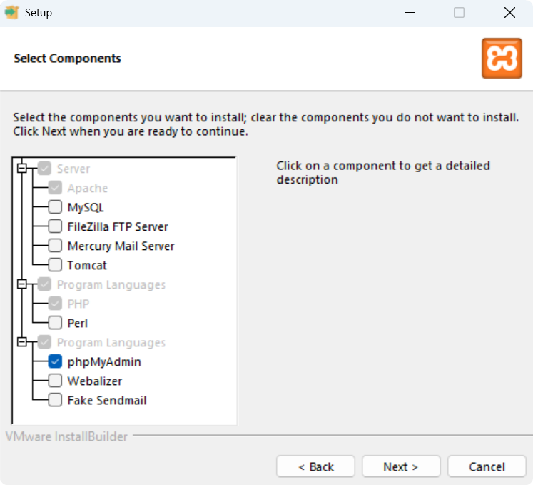
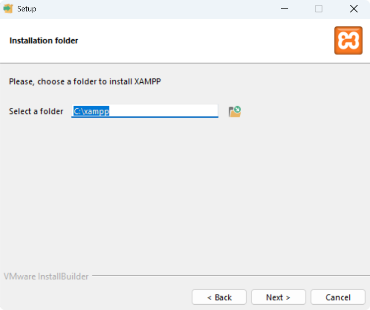
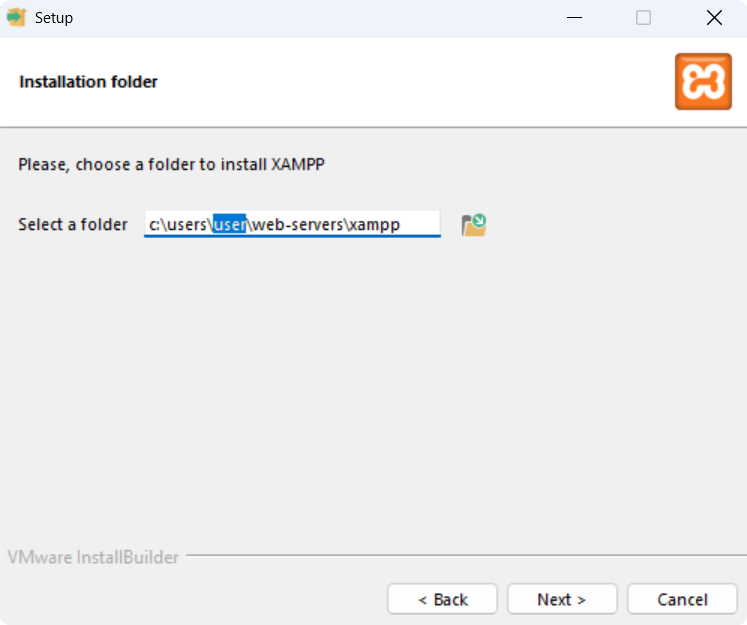

# Installing PHP using XAMPP

If you must install [XAMPP](https://www.apachefriends.org "XAMPP") for PHP, do not install MySQL in XAMPP. Instead, use the [MySQL installer](https://dev.mysql.com/downloads/installer/ "MySQL Installer") to install MySQL.

In the XAMPP installer, you can select the components you want to install. You can install Apache, PHP, and phpMyAdmin without installing MySQL or other unnecessary components.

- [x] Server
  - [x] Apache
  - [ ] MySQL
  - [ ] FileZilla FTP Server
  - [ ] Mercury Mail Server
  - [ ] Tomcat
- [x] Program Languages
  - [x] PHP
  - [ ] Perl
- [x] Program Languages
  - [x] phpMyAdmin
  - [ ] Webalizer
  - [ ] Fake Sendmail







For a user install, replace `user` with your username/user directory, and set *Select a folder* to:

```bash
c:\users\user\web-servers\xampp
```

For a system install set *Select a folder* to:

```bash
C:\xampp
```

```bash
xampp-installer.exe --optionfile C:\Users\user\Documents\GitHub\LearnToCode.php\docs\xampp-options.conf
```
